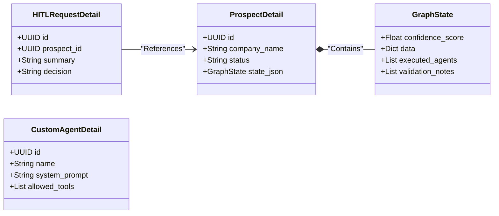
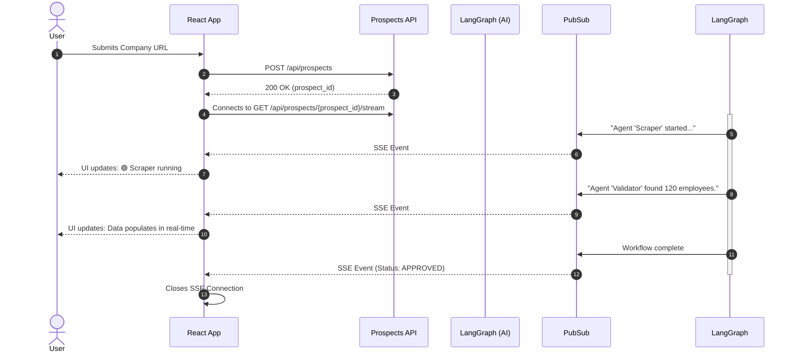
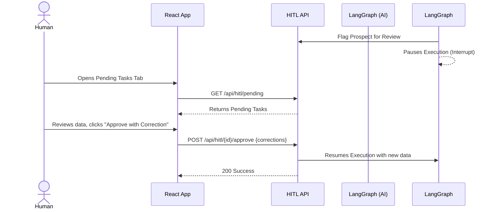

# 🎨 Frontend Specification & UX Guidelines
**Agentic SaaS Platform (ICP Agent)**

This document provides a highly detailed specification for the frontend engineering team. It includes API references, TypeScript data models, architectural sequence diagrams, and UX guidelines specifically tailored for a real-time, agent-driven application.

---

## 🏗️ 1. System Architecture & UI Expectations

The platform is an agentic AI system for B2B customer discovery. It dynamically routes prospects through multiple AI agents (Identification, Validation, Enrichment, Summarization) via **LangGraph**.

### **Core Frontend Responsibilities**
1. **Dynamic Configuration**: UI for configuring Ideal Customer Profiles (ICP), Target Personas, and Confidence Thresholds.
2. **Prospect Management**: Submitting prospects and visualizing their journey through the AI pipeline.
3. **Real-time Observation**: Implementing Server-Sent Events (SSE) to stream live agent activities, giving users a "fast, thinking" system feel.
4. **Human-in-the-Loop (HITL)**: A dedicated dashboard for reviewing borderline prospects that the AI flagged for human approval.
5. **Custom Agent Builder**: Interface for creating and managing custom AI agents.

---

## 📡 2. API Endpoints Reference

The backend exposes a FastAPI REST interface. All endpoints are prefixed with `/api`.

| Domain | Method | Endpoint | Description |
| :--- | :--- | :--- | :--- |
| **Config** | `GET` | `/api/config/icp` | Fetch the current ICP rules. |
| **Config** | `PUT` | `/api/config/icp` | Update the ICP rules. |
| **Config** | `GET` | `/api/config/persona` | Fetch target persona criteria. |
| **Config** | `PUT` | `/api/config/persona` | Update persona criteria. |
| **Config** | `GET` | `/api/config/thresholds` | Fetch AI confidence & auto-approve thresholds. |
| **Config** | `PUT` | `/api/config/thresholds` | Update AI thresholds. |
| **Prospects** | `GET` | `/api/prospects` | List all prospects. Supports `?status`, `?company_name`, `?limit`, `?offset`. |
| **Prospects** | `POST` | `/api/prospects` | Submit a new company for processing. |
| **Prospects** | `GET` | `/api/prospects/{id}` | Fetch detailed history and state for a prospect. |
| **Prospects** | `GET` | `/api/prospects/{id}/stream` | **[CRITICAL]** Subscribe to SSE stream for real-time agent execution updates. |
| **HITL** | `GET` | `/api/hitl/pending` | List all tasks awaiting human review. |
| **HITL** | `GET` | `/api/hitl/{id}` | Get specific HITL task details. |
| **HITL** | `POST` | `/api/hitl/{id}/approve` | Approve HITL task (resumes workflow). |
| **HITL** | `POST` | `/api/hitl/{id}/reject` | Reject HITL task. |
| **Agents** | `GET` | `/api/agents` | List all custom agents registered in the system. |
| **Agents** | `POST` | `/api/agents` | Create a new Custom Agent. Payload uses `CustomAgentCreate`. |
| **Agents** | `DELETE` | `/api/agents/{id}` | Delete a specific Custom Agent. |
| **Triggers** | `GET` | `/api/triggers/sources` | List monitoring trigger sources. |
| **Triggers** | `POST` | `/api/triggers/sources` | Create a new trigger source. |
| **Events** | `GET` | `/api/events` | Fetch the last 50 global system events for an activity feed. |

---

## 🧩 3. TypeScript Models & DTOs

### 3.1 Configuration Models

```typescript
export interface ICPCriteria {
  industries: string[];
  min_revenue: number;
  max_revenue: number;
  min_employees: number;
  max_employees: number;
  locations: string[];
  tech_stack: string[];
  behaviors: string[];
  operator: 'AND' | 'OR';
}

export interface PersonaDefinition {
  job_titles: string[];
  seniority_levels: string[];
  functions: string[];
  exclude_titles?: string[];
}

export interface ThresholdConfig {
  min_confidence_score: number;
  max_errors_allowed: number;
  hitl_confidence_threshold: number;
  auto_approve_threshold: number;
}
```

### 3.2 Custom Agent Models

```typescript
export interface CustomAgentCreate {
  name: string;
  description: string;
  system_prompt: string;
  allowed_tools: string[]; // e.g., ["search_web", "scrape_site", "linkedin_enrich"]
}

export interface CustomAgentDetail extends CustomAgentCreate {
  id: string; // UUID
  created_at: string; // ISO DateTime
}
```

### 3.3 Prospect & Workflow State Models

```typescript
export interface ProspectSummary {
  id: string; // UUID
  display_id?: string;
  company_name: string;
  status: 'PENDING' | 'PROCESSING' | 'APPROVED' | 'REJECTED' | 'FAILED' | 'HITL';
  updated_at: string;
}

export interface ValidationNote {
  level: 'info' | 'warning' | 'error';
  message: string;
  source_agent: string;
  timestamp: number;
}

export interface GraphState {
  prospect_id: string;
  current_trigger_event: string;
  config: Record<string, any>;
  data: Record<string, any>; // Discovered data (firmographics, contacts, etc.)
  validation_notes: ValidationNote[];
  confidence_score: number;
  overall_status: string;
  executed_agents: string[]; // Trace of agents that ran
  errors: string[];
  next_node: string;
  last_agent: string;
}

export interface ProspectDetail extends ProspectSummary {
  website?: string;
  state_json: GraphState;
  created_at: string;
  workflow_thread_id?: string;
}
```

### 3.4 Human-In-The-Loop Models

```typescript
export interface HITLRequestDetail {
  id: string;
  display_id?: string;
  prospect_id: string;
  summary: string; // Context for the human reviewer
  decision?: 'APPROVED' | 'REJECTED';
  corrections?: Record<string, any>; // Optional user edits before approval
  created_at: string;
  resolved_at?: string;
}
```

---

## 📊 4. Data Relationship Diagram



---

## 🚀 5. UX & Real-Time Streaming Guidelines

To make the platform feel **fast, intelligent, and agentic**, we must rely heavily on Server-Sent Events (SSE). Instead of showing a static loading spinner for 30 seconds while the AI works, stream the AI's internal thoughts and agent transitions.

### 5.1 Prospect Processing Sequence

When a user submits a company, instantly connect to the SSE endpoint to stream the progress. 



### 5.2 Streaming UI Implementation Checklist
- **Terminal/Log Window**: Create a small UI component that looks like a terminal or log feed. As SSE events come in, append them to this window so the user sees exactly what the AI is "thinking" or doing in real-time.
- **Skeleton Loaders**: While waiting for specific data blocks (e.g., Tech Stack, Contacts), show pulsing skeleton loaders. Replace them instantly when the `data` object in the SSE state stream updates.
- **Cleanup**: Always call `eventSource.close()` in your component's unmount (`useEffect` cleanup function) to prevent memory leaks.

---

## 🧠 6. HITL Resolution UX

When an AI agent is unsure (low confidence score), it triggers a HITL request. It is crucial to make the human review process as fast and seamless as possible.



### UX Guideline for HITL (Human-in-the-Loop)
Present the user with a **Side-by-Side Diff** UI:
1. **Left Side (AI Findings)**: Display the raw data and logic the AI found, highlighting exactly why it is not confident (e.g., "Could not verify company revenue").
2. **Right Side (Human Override)**: Provide form fields for the human to type in the missing or corrected data.
3. **Actions**: A prominent "Approve and Resume Workflow" button that patches the state via the `corrections` payload and unblocks the LangGraph workflow.
